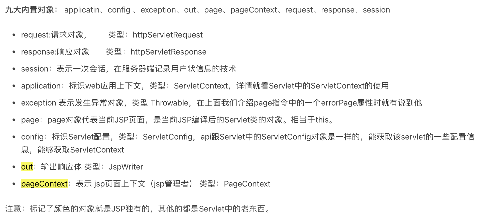
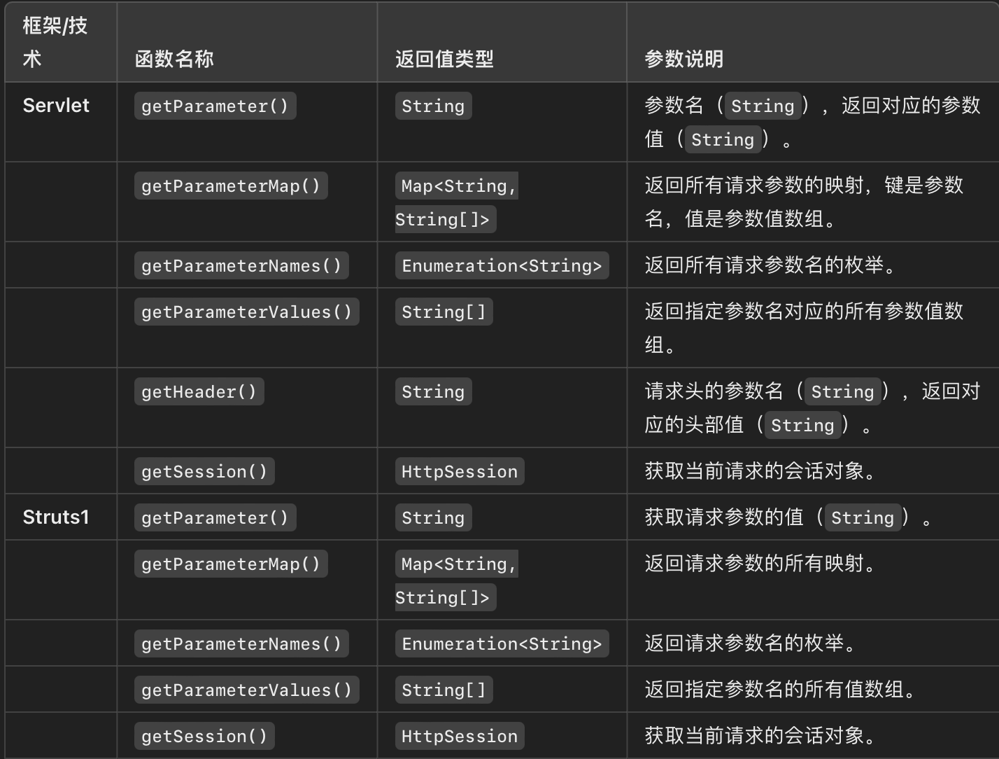
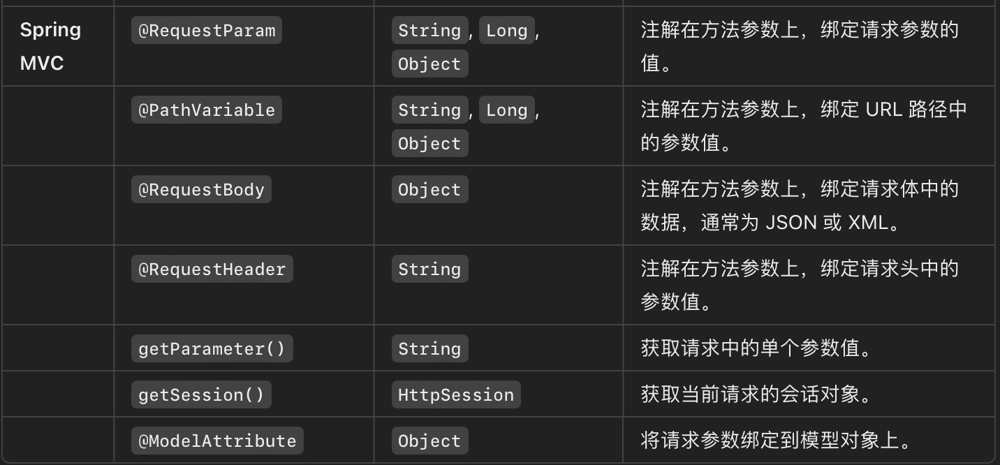

# 考试大纲

### JSP隐含对象 7个隐含对象



## JSP原理(JSP->Java)

### 有四种声明模式

```
<%- -%> 注释
<%! %> 声明 只在第一次部署的时候执行 
<%= %> 输出 相当于out.println
<% %> 脚本 中间是java程序 这是一个函数相当于不能再在其中定义函数 每次访问都会执行
```

### 四大作用域

```
application：整个web。作用于整个Web应用，多个用户之间共享。
session：单会话。作用于整个Web应用，单个用户之间共享。
request：单个请求。作用于请求，转发间请求共享。
page：当前页。作用于当前页面，当前页面可见。
```

指令元素   page includ taglib

```
页面指令：<%@ page ... %> 用于设置JSP页面属性。
<%@ page language="java" contentType="text/html; charset=UTF-8" %>

包含指令：<%@ include file="..." %> 用于包含其他文件的内容。
<%@ include file="header.jsp" %>

标签库指令：<%@ taglib uri="..." prefix="..." %> 用于引入自定义标签库（学习JSTL时会使用到）。
<%@ taglib uri="http://java.sun.com/jsp/jstl/core" prefix="c" %>
```

动作元素  `<jsp:include>             <jsp:forward>             <jsp:useBean>`

`<jsp:include page="index.jsp" />`

`<jsp:forward page="error.jsp" />`

`<jsp:useBean id="user" class="com.example.User" scope="request" />`

```

```

## EL表达式语言

每次访问都会执行 ` ${}  eg:<p>Welcome, ${username}!</p>`

## PageContext类

属性相关函数：getAtrribute() setAttribute()

获取隐含对象：`getOut() getResponse() getRequest() getSession() getServletContext() getServletConfig() `

异常：`getException()`

`getPage() getELcontext()`

## Servlet接口，Servlet原理，web.xml, web.xml文件中 `<context-param>`

Servlet接口例子 包含三个：init doGet destroy

```java
public class MyServlet extends HttpServlet {

    // 初始化方法，仅调用一次
    public void init(ServletConfig config) throws ServletException {
        super.init(config);
        System.out.println("Servlet is being initialized");
    }

    // 处理 GET 请求
    protected void doGet(HttpServletRequest request, HttpServletResponse response) throws ServletException, IOException {
        response.setContentType("text/html");
        PrintWriter out = response.getWriter();
        out.println("<html><body>");
        out.println("<h2>Hello, Servlet!</h2>");
        out.println("</body></html>");
    }

    // 销毁方法，释放资源
    public void destroy() {
        System.out.println("Servlet is being destroyed");
    }
}

```

```xml
<context-param>
    <param-name>databaseURL</param-name>
    <param-value>jdbc:mysql://localhost:3306/mydb</param-value>
</context-param>
<context-param>
    <param-name>maxConnections</param-name>
    <param-value>10</param-value>
</context-param>

```

```java
ServletContext context = getServletContext();//servlet继承了HttpServlet 而getServletContext()是在HttpServlet中实现的
String dbURL = context.getInitParameter("databaseURL");  //注意是init
int maxConnections = Integer.parseInt(context.getInitParameter("maxConnections"));

```

## HttpServlet类

```Java
@WebServlet("/exampleServlet")
public class ExampleServlet extends HttpServlet {

    // 处理 GET 请求
    @Override
    protected void doGet(HttpServletRequest request, HttpServletResponse response) throws ServletException, IOException {
        response.setContentType("text/html");
        PrintWriter out = response.getWriter();
        out.println("<html><body>");
        out.println("<h1>Welcome to ExampleServlet - GET Request</h1>");
        out.println("</body></html>");
    }

    // 处理 POST 请求
    @Override
    protected void doPost(HttpServletRequest request, HttpServletResponse response) throws ServletException, IOException {
        response.setContentType("text/html");
        PrintWriter out = response.getWriter();
        String name = request.getParameter("name");
        out.println("<html><body>");
        out.println("<h1>Welcome, " + name + " - POST Request</h1>");
        out.println("</body></html>");
    }
}

```

## Filter接口 Filter原理

包含3部分 init doFilter destroy

可以在xml文件中定义

分为两部分 `<filter>` `</filter>                   <filter-mapping> </filter-mapping>`

前一部分定义过滤器的基本信息 后一部分定义路径和适用范围，两个部分中的filter-name必须一致

```xml
<filter>
    <filter-name>MyFilter</filter-name>
    <filter-class>com.example.MyFilter</filter-class>
</filter>

<filter-mapping>
    <filter-name>MyFilter</filter-name>
    <url-pattern>/myServlet</url-pattern>
</filter-mapping>

```

或者直接使用注解@WebFilter

```java
import javax.servlet.*;
import javax.servlet.annotation.WebFilter;
import java.io.IOException;

@WebFilter("/*") // 应用于所有请求
public class EncodingFilter implements Filter {

    @Override
    public void init(FilterConfig filterConfig) throws ServletException {
        // 初始化编码参数
    }

    @Override
    public void doFilter(ServletRequest request, ServletResponse response, FilterChain chain) throws IOException, ServletException {
        // 设置请求和响应的字符编码
        request.setCharacterEncoding("UTF-8");
        response.setCharacterEncoding("UTF-8");

        // 放行请求
        chain.doFilter(request, response);
    }

    @Override
    public void destroy() {
        // 清理资源
    }
}

```

## ServletConfig接口

简简单单 只有几个函数   Ps：getServletConfig( )是在HttpServlet中实现的

```
getInitParameter(string name)
getInitparameterNames() 返回Enumeration 所有初始变量的名称集合
还可以获取ServletContext      getServletContext()   getServletName()
```

```java
package a;

import java.io.*;
import java.util.*;
import javax.servlet.*;
import javax.servlet.http.*;

public class ServletConfigDemoServlet extends HttpServlet {
	protected void doGet(HttpServletRequest request, HttpServletResponse response) throws ServletException, IOException {
		ServletConfig sc = getServletConfig();
		Enumeration<String> names = sc.getInitParameterNames();

		Map<String,String> initParameters = new HashMap<String,String>();

		while(names.hasMoreElements()) {
			String param_name = names.nextElement();
			String param_value = sc.getInitParameter(param_name);
			initParameters.put(param_name, param_value);
		}

		response.setContentType("text/html;charset=utf-8");
		PrintWriter out = response.getWriter();
		out.println(initParameters);
	}
}

```

## ServletRequestEvent类，HttpSessionEvent类

ServletRequestEvent 在ServletRequestListener中使用 ServletRequestListener有两个接口 requestInitialized requestDestroyed 需要用到

```java
public class MyRequestListener implements ServletRequestListener {
    @Override
    public void requestInitialized(ServletRequestEvent sre) {
        System.out.println("Request initialized: " + sre.getServletRequest());
    }

    @Override
    public void requestDestroyed(ServletRequestEvent sre) {
        System.out.println("Request destroyed: " + sre.getServletRequest());
    }
}

```

HttpSessionEvent在HttpSessionListener中使用 同样有两个接口 sessionCreated sessionDestroyed

```java
public class MySessionListener implements HttpSessionListener {
    @Override
    public void sessionCreated(HttpSessionEvent se) {
        System.out.println("Session created: " + se.getSession().getId());
    }

    @Override
    public void sessionDestroyed(HttpSessionEvent se) {
        System.out.println("Session destroyed: " + se.getSession().getId());
    }
}

```

## Listener组件

```java
package listener;

import javax.servlet.ServletRequestEvent;
import javax.servlet.ServletRequestListener;
import javax.servlet.annotation.WebListener;
import javax.servlet.http.HttpServletRequest;
import javax.servlet.http.HttpSession;

import num.NumberGuessBean;

/**
 * Application Lifecycle Listener implementation class ResetGuessBeanListener
 *
 */
@WebListener
public class ResetGuessBeanListener implements ServletRequestListener {


	/**
     * @see ServletRequestListener#requestDestroyed(ServletRequestEvent)
     */
    public void requestDestroyed(ServletRequestEvent sre)  { 
   
         HttpServletRequest request = (HttpServletRequest) sre.getServletRequest();
         HttpSession session = request.getSession();
   
         if(session.getAttribute("numguess")!=null) {
        	 NumberGuessBean numguess = (NumberGuessBean) session.getAttribute("numguess");
        	 if(numguess.getSuccess()) {
        		 numguess.reset();
        	 }
         }
    }

	/**
     * @see ServletRequestListener#requestInitialized(ServletRequestEvent)
     */
    public void requestInitialized(ServletRequestEvent sre)  { 
         // TODO Auto-generated method stub
    }

}

```

## ServletRequest, ServletResponse,HttpServletRequest, HttpServletResponse

```java
/**
 * Servlet implementation class RequestDemoServlet
 */
@WebServlet({ "/RequestDemoServlet", "/request" })
public class RequestDemoServlet extends HttpServlet {
	private static final long serialVersionUID = 1L;

	/**
	 * @see HttpServlet#doGet(HttpServletRequest request, HttpServletResponse response)
	 */
	//ServletRequest 没有cookie
	protected void doGet(HttpServletRequest request, HttpServletResponse response) throws ServletException, IOException {
		response.setContentType("text/html;charset=utf-8");
		PrintWriter out = response.getWriter();

		out.println("url: " + request.getRequestURL());// http://localhost:8080/request/RequestDemoServlet 类型：string buffer
		out.println("<br>");
		out.println("uri: " + request.getRequestURI());// /request/RequestDemoServlet string
		out.println("<br>");
		out.println("Context Path: " + request.getContextPath());//  /request
		out.println("<br>");
		out.println("Servlet Path: " + request.getServletPath());// /request   如果只提到这个网址 有可能在根路径下所以返回“”也有可能返回“request”
		out.println("<br>");
		out.println("parameter a: " + request.getParameter("a"));// 
		out.println("<br>");
		out.println("parameters b: " + request.getParameterValues("b"));// 返回字符串数组 values
		out.println("<br>");
		out.println("QueryString: " + request.getQueryString());
		out.println("<br>");
	}

	/**
	 * @see HttpServlet#doPost(HttpServletRequest request, HttpServletResponse response)
	 */
	protected void doPost(HttpServletRequest request, HttpServletResponse response) throws ServletException, IOException {
		// TODO Auto-generated method stub
		doGet(request, response);
	}

}

```

除此以外

request可以用于转发，response可以用于重定向

```
request.getRequestDispatcher(url地址/转发到资源的地址).forward(req, res);
```

```java
//测试1: 从当前Servlet（day10/TestRedirect）重定向到day10/index.jsp
// http://localhost/day10/TestRedirect
// http://localhost/day10/index.jsp
response.sendRedirect( "http://localhost/day10/index.jsp" );
response.sendRedirect( "/day10/index.jsp" );
response.sendRedirect( "/index.jsp" ); //错误路径
response.sendRedirect( "index.jsp" ); //正确路径

//测试2: 从当前Servlet重定向到day09/index.jsp
response.sendRedirect( "http://localhost/day09/index.jsp" );

//测试3: 从当前Servlet重定向到百度首页
response.sendRedirect( "http://www.baidu.com" );

```

## ServletContext接口

每个Servlet都有一个getServletContext方法，可以用来获取ServletContext对象。例如：

`ServletContext context = getServletContext();`

ServletConfig是Servlet的配置对象，也提供了获取 `ServletContext`的方法：

`ServletContext context = getServletConfig().getServletContext();`

还可以在ServletContextListener 从ServletContextEvent中获取

```java
public class MyServletContextListener implements ServletContextListener {
    public void contextInitialized(ServletContextEvent event) {
        ServletContext context = event.getServletContext();
        // 在这里可以对ServletContext进行操作
    }

    public void contextDestroyed(ServletContextEvent event) {
        // Web应用程序关闭时的操作
    }
}
```

有以下功能：

### 可以setAttribute("abc",6)

### 访问资源文件

### getInitParamter("")

### 获取文件路径

```java
ServletContext context = getServletContext();
String realPath = context.getRealPath("/WEB-INF/config.properties");
File file = new File(realPath);
```

### 获取资源路径

```java
ServletContext context =getServletContext();
URL resourceUrl = context**.getResource("/images/logo.png")**;
```

## Web Annotations， WebServlet, WebFilter, WebListener

```java
@WebServlet(name = "MyServlet", urlPatterns = {"/myServlet", "/anotherPath"}, loadOnStartup = 1)
public class MyServlet extends HttpServlet {
    @Override
    protected void doGet(HttpServletRequest request, HttpServletResponse response) throws IOException {
        response.getWriter().write("Hello from MyServlet!");
    }
}
```

`@WebFilter(filterName = "MyFilter", urlPatterns = {"/protected/*"})`

```java
@WebListener
public class MyContextListener implements ServletContextListener {
    @Override
    public void contextInitialized(ServletContextEvent sce) {
        System.out.println("Application started!");
    }

    @Override
    public void contextDestroyed(ServletContextEvent sce) {
        System.out.println("Application stopped!");
    }
}
```

## 路径匹配

内容整理
Servlet四种匹配方式

1. 精确匹配，例如：/hello
2. 路径匹配，以/开头，以*结尾,例如，/*，/api/*
3. 后缀名匹配，以*开头，例如：*.jsp，*.html
4. 缺省匹配，固定值/

***注意：路径匹配的时候，以结尾，后缀匹配的时候必须在最前面
所以，/api/*.html这是非法的路径。启动服务器的时候报错***

匹配顺序：精确匹配 > 路径匹配 > 后缀名匹配 > 缺省匹配。

/ 和 /* 的区别
关于/
servlet中特殊的匹配模式（用在Filter中无效），
因为是缺省匹配代表匹配所有路径，所以只可能存在一个实例（若存在多个就覆盖）
优先级最低（兜底），这是和/*的最大区别。它不会覆盖任何其它的url-pattern，只会覆盖Servlet容器（如Tomcat）内建的DefaultServlet

关于/*
属于4中匹配模式中的路径匹配，可用于Servlet和Filter
优先级很高（仅次于精确匹配）。所以它会覆盖所有的后缀名匹配，从而很容易引起404问题，所以这种模式的“伤害性”是非常强的，一般有且仅用在Filter上

大家熟悉的Spring MVC的DispatcherServlet的匹配路径默认就是/，它会拦截各种各样的请求，诸如下面这种请求都会拦截：

/api/demo1
/html/demo1.html
/static/main.js

但是它不会拦截jsp，原因是：
Servlet容器（如Tomcat）内置有专门匹配*.jsp这种请求的Servlet处理器
后缀名匹配优先级高于缺省匹配

## Tag, SimpleTag, TagSupport, SimpleTagSupport

Tag      `doStartTag doEndTag()`

其中 doStartTag( )返回：

* `EVAL_BODY_INCLUDE`：表示继续处理标签体内容。
* `SKIP_BODY`：表示跳过标签体内容，不输出任何内容。

而doEndTag( )返回：

`EVAL_PAGE`：继续执行 JSP 页面后续的内容。

`SKIP_PAGE`：跳过 JSP 页面剩余部分的执行，直接跳到页面的结束部分。

SimpleTag    `doTag()没有返回值`

## Tag原理

在java文件中实现

```java
package mytags;

import javax.servlet.jsp.*;
import javax.servlet.jsp.tagext.*;
import java.util.*;
import java.text.*;

//这个标记处理器类实现按照指定的格式和颜色样式输出时间
public class TimeTag extends TagSupport {
	private String color, format;

	// 定义了color属性的写方法
	public void setColor(String color) {
		this.color = color;
	}

	// 定义了format属性的写方法
	public void setFormat(String format) {
		this.format = format;
	}

	// 因为是空元素，所以略过体内容处理过程，这个方法也可以不写。
	// 使用TagSupport类的默认实现也可以。
	public int doStartTag() throws JspException {
		return SKIP_BODY;
	}

	public int doEndTag() throws JspException {
		try {
			Date d = new Date();
			if (format == null) { // 如果JSP没有传递格式过来，format为null
				format = "yyyy-MM-dd"; // 默认的格式
			}
			if (color == null) { // 如果JSP没有传递颜色过来，color为null
				color = "black"; // 默认的颜色
			}
			// java.text.SimpleDateFormat可以按照指定的日期格式将Date数据
			// 转换为字符串，见JavaSE平台的SimpleDateFormat API规范
			SimpleDateFormat sdf = new SimpleDateFormat(format);
			String sd = sdf.format(d);

			// JspWriter类继承自Writer类，其输出数据的方法write，print，println
			// 等方法都有IOException的异常声明，所以需要捕获这个异常并处理。
			JspWriter out = pageContext.getOut();
			out.write("<font color=\"" + color + "\">" + sd + "</font>");
		} catch (Exception e) {
			throw new JspException(e);
		}
		return EVAL_PAGE;
	}

	// 在JSP页面中调用完毕标记处理器对象后，要调用release方法，
	// 将这个对象释放回对象池中，所以需要将format，color变量置为null
	public void release() {
		format = null;
		color = null;
	}
}

```

在tld文件中声明

```xml
<tag>
		<name>time</name>
		<tag-class>mytags.TimeTag</tag-class>
		<body-content>empty</body-content>
		<!--在time标记中，声明了两个属性 -->
		<attribute>
			<name>color</name>
			<required>false</required>  		<!--这个属性不是必须的 -->
			<rtexprvalue>true</rtexprvalue> 	<!--属性值可以是动态的表达式 -->
			<type>java.lang.String</type>   	<!--声明属性的类型 -->
		</attribute>

		<attribute>
			<name>format</name>
			<required>false</required>
			<rtexprvalue>true</rtexprvalue>
			<type>java.lang.String</type>
		</attribute>

	</tag>
```

在jsp文件中使用

```jsp
<%-- 在JSP程序中，通过属性向标记处理器对象传递数据  --%>
	<t:time color="red" format="yyyy-MM-dd HH:mm:ss" />
	<br>
	<%--没有传递color属性，这是可以的，因为color属性不是必须的属性--%>
	<t:time format="yy-MM-dd" />
```


## Spring控制器

## Spring视图

## Cookie相关函数，相关操作。

```java
import javax.servlet.ServletException;
import javax.servlet.annotation.WebServlet;
import javax.servlet.http.*;
import java.io.IOException;

@WebServlet("/cookieExample")
public class CookieExampleServlet extends HttpServlet {
    protected void doGet(HttpServletRequest request, HttpServletResponse response) throws ServletException, IOException {
        // 添加 Cookie
        Cookie cookie = new Cookie("user", "Alice");
        cookie.setMaxAge(24 * 60 * 60); // 1 day
        response.addCookie(cookie);
  
        // 读取 Cookie
        Cookie[] cookies = request.getCookies();
        String username = null;
        if (cookies != null) {
            for (Cookie c : cookies) {
                if ("user".equals(c.getName())) {
                    username = c.getValue();
                    break;
                }
            }
        }
  
        // 修改 Cookie
        Cookie updatedCookie = new Cookie("user", "Bob");
        updatedCookie.setMaxAge(24 * 60 * 60); // 1 day
        response.addCookie(updatedCookie);
  
        // 删除 Cookie
        Cookie deleteCookie = new Cookie("user", null);
        deleteCookie.setMaxAge(0); // 删除 Cookie
        response.addCookie(deleteCookie);
  
        // 响应输出
        response.setContentType("text/html;charset=UTF-8");
        response.getWriter().println("Cookie 操作完成！");
    }
}

```

## 获取客户端提交参数相关函数

常见的就是

## tld文件结构

## struts 1, ActionServlet, Action, ActionForm, DynaActionForm

猜数游戏 action.java

```java
public class GuessAction extends Action {
  
    @Override
    public ActionForward execute(ActionMapping mapping, ActionForm form,
                                 HttpServletRequest request, HttpServletResponse response) {

        // 1. 将传入的ActionForm对象转换为DynaActionForm以便动态获取表单数据
        DynaActionForm guessForm = (DynaActionForm) form;

        // 2. 使用guessForm获取用户的输入值 "guess"，即用户的猜数
        String guess = (String) guessForm.get("guess");

        // 3. 获取当前会话session，用于存储和读取用户的猜数游戏状态
        HttpSession session = request.getSession();

        // 4. 获取或创建NumberGuessBean实例，用于存储用户的猜数、提示和状态
        NumberGuessBean numguess = null;
        if (session.getAttribute("numguess") != null) {
            // 如果用户已有存储在session中的NumberGuessBean实例，则获取它
            numguess = (NumberGuessBean) session.getAttribute("numguess");
        } else {
            // 如果没有，则创建一个新的实例并存储到session中
            numguess = new NumberGuessBean();
            session.setAttribute("numguess", numguess);
        }

        // 5. 调用NumberGuessBean的setGuess方法来处理用户的猜测，并更新状态
        numguess.setGuess(guess);
  
        // 6. 将更新后的numguess对象重新设置到session中，保存最新状态
        session.setAttribute("numguess", numguess);

        // 输出当前用户的猜测和相应提示，方便调试
        System.out.println("User guess: " + guess + ", Hint: " + numguess.getHint());

        // 7. 判断用户是否猜中，如果成功，则转向"success"页面
        if (numguess.getSuccess()) { 
            // 猜中后重置NumberGuessBean，开始新的猜数游戏
            numguess.reset();
            session.setAttribute("numguess", numguess); // 更新重置后的状态
            return mapping.findForward("success"); // 转向配置的success页面
        } else {
            // 如果未猜中，更新表单提示信息并返回继续页面
            guessForm.set("hint", numguess.getHint()); // 设置提示信息
            guessForm.set("numGuesses", String.valueOf(numguess.getNumGuesses())); // 设置猜测次数

            return mapping.findForward("continue"); // 转向配置的continue页面
        }
    }
}

```

## DispatchAction.java,MappingDispatchAction.java,

LookupDispatchAction.java,
ActionForward, ActionMapping

Action.java

```java
public class LoginAction extends Action {
    @Override
    public ActionForward execute(ActionMapping mapping, ActionForm form,
                                 HttpServletRequest request, HttpServletResponse response) throws Exception {
        // 从请求中获取用户名和密码
        String username = request.getParameter("username");
        String password = request.getParameter("password");

        if ("admin".equals(username) && "password".equals(password)) {
            // 登录成功，返回 "success" 的 ActionForward
            return mapping.findForward("success");
        } else {
            // 登录失败，返回 "failure" 的 ActionForward
            request.setAttribute("error", "Invalid username or password.");
            return mapping.findForward("failure");
        }
    }
}

```

struts-config.xml

```xml
<action path="/login" 
        type="com.example.LoginAction">
    <!-- 成功的转向路径 -->
    <forward name="success" path="/welcome.jsp"/>
    <!-- 失败的转向路径 -->
    <forward name="failure" path="/login.jsp"/>
</action>

```

## struts1 配置文件

关于form的使用

在struts-config.xml中定义了从input提交一个表单到/calc

index.jsp

```
<html:form action="/calc" >
            n1: <html:text property="n1" /><br>
            n2: <html:text property="n2" /><br>
    
            <html:submit property="submit" value="Add"/>
        </html:form>
```

result.jsp

 result is: <bean:write name="calcForm" property="result"/>

```xml
	<form-beans>
		<form-bean name="calcForm" type="com.abc.form.CalcForm" />
	</form-beans>

	<action-mappings>
		<action path="/calc" type="com.abc.action.CalcAction" name="calcForm"
			input="/input.jsp">
			<forward name="result" path="/result.jsp" redirect="false" />
		</action>
	</action-mappings>
```

## Web应用文件结构

## HttpSession

## JspWriter

`JspWriter` 类提供了与** **`HttpServletResponse.getWriter()` 类似的功能，但是它专门用于JSP页面。

```jsp
JspWriter out = pageContext.getOut();

        // 输出一些内容
        out.write("Hello, JSP!<br>"); //<br>是换行符
        out.println("This is a JSP page.");
```

## 猜数游戏程序（Struts1, Spring)

其中猜数游戏的两个实现代码，还有DispatchAction.java, MappingDispatchAction.java,LookupDispatchAction.java,
是考核重点。

servletcontext和servletconfig都有getinitparam

## 不属于 Action 接口中定义的字符串常量的是( B )

A.INPUT B.FAILURE C.SUCCESS D.ERROR

# 相对路径和绝对路径

```java
从当前Servlet转发到index.jsp(http://localhost/day10/index.jsp)
request.getRequestDispatcher("/index.jsp").forward(request, response);
request.getRequestDispatcher("index.jsp").forward(request, response);
```

***相对路径** ：不以* `/` 开头。相对路径是相对于当前 Servlet 的路径。

`request.getRequestDispatcher("index.jsp")` 表示相对于当前 Servlet 路径的 `index.jsp` 文件。
 例如，假设当前 Servlet 路径是**`/day10/someServlet`，这个相对路径会指向 **`/day10/index.jsp`，如果这个路径下没有** **`index.jsp` 文件，页面将无法找到资源。
 **绝对路径** ：以 `/` 开头。绝对路径是相对于应用根目录的路径。
 `request.getRequestDispatcher("/index.jsp")` 表示从应用的根目录开始寻找 `index.jsp` 文件。
 如果** `index.jsp` 在** **`/day10/` 目录下，正确的写法应为** `request.getRequestDispatcher("/day10/index.jsp")`。

## getRequestURL() 返回string buffer

相比于string string buffer可以改变 它是基于数组实现的
